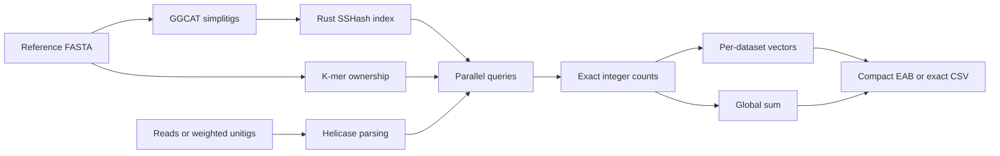

# EXPRESSO

**EXon-level RNA EXPRESsion quantificatiOn**

A parallel Rust tool for counting exon-specific k-mer observations in reads or
abundance-annotated unitigs. Build an index once, quantify many datasets, and
store one compact abundance vector per dataset plus a global sum.

EXPRESSO combines **GGCAT simplitigs**, the **Rust SSHash dictionary**, and
**Helicase FASTA/FASTQ parsing**. Reference and query files can be uncompressed,
gzip, xz, or Zstandard. K-mers shared by multiple reference records are excluded.

**At corpus scale:** 822,115 datasets, **75.52 TB of compressed input**, processed
in **57 h 31 min** on 64 workers. The complete 8-bit result bundle occupies
**82.15 GB**. Of 822,141 attempted datasets, 26 malformed inputs were explicitly
excluded. These measurements use whole GENCODE v49 **transcripts** as reference
records, rather than an exon reference. [Benchmark details](docs/BENCHMARKS.md).

- **Reusable index:** canonical k-mers, compact 16- or 32-bit target ownership.
- **Reads or unitigs:** count occurrences directly or apply Logan/GGCAT header abundances.
- **Parallel queries:** share the index across datasets and divide a total worker budget.
- **Compact output:** 2–16 bits per abundance, 8 by default, followed by zstd/gzip/xz compression.
- **CSV on demand:** export selected datasets, the global sum, or the entire result set.
- **Explicit coverage:** optional continuation after failed datasets, with errors recorded.

[Install](#installation) · [Quick start](#quick-start) · [Inputs](#inputs) ·
[Counting](#counting-semantics) · [Outputs](#outputs-and-csv-export) ·
[Long runs](#long-runs-and-progress-logs) · [Performance](#performance) ·
[References](#preparing-exon-and-gene-references) · [Tests](#validation)

## How it works



Shared k-mers stay in the dictionary but have no usable owner. The global sum
is calculated **before** compact output is quantized.

## Installation

Requirements: **Rust 1.88+**, a C toolchain, `pkg-config`, and a
[GGCAT executable with simplitig support](https://github.com/algbio/ggcat).
GGCAT is needed only for building indexes; SSHash and Helicase are linked Rust
libraries. Python 3 is needed only for the helper scripts.

```bash
git clone https://github.com/Malfoy/Expresso.git
cd Expresso
cargo build --release --locked
export PATH="$PWD/target/release:$PATH"

expresso --help
ggcat build --help
```

Alternatively, install the executable into Cargo's binary directory:

```bash
RUSTFLAGS="-C target-cpu=native" cargo install --path . --locked
```

The repository's Cargo configuration enables `target-cpu=native` for SIMD.
Build on the machine that will run EXPRESSO, or one with the same CPU instruction
set. `--features no-pdep` is available for older AMD CPUs. Use
`--ggcat /path/to/ggcat` if GGCAT is not on `PATH`.

## Quick start

Run the included small example:

```bash
expresso run \
  --exons examples/exons.fa --index example-index --k 7 \
  --fof examples/datasets.tsv --output example-results \
  --threads 4 --jobs 2 --stats

expresso export \
  --input example-results --output example-csv \
  --compression none --with-names
```

For your own data, build once and reuse the index:

```bash
expresso build \
  --exons exons.fa.gz --index exon-index \
  --k 31 --threads 16 --memory-gb 8

expresso quantify \
  --index exon-index --fof datasets.tsv --output results \
  --threads 16 --jobs 4 --mode unitigs

expresso inspect --index exon-index
```

Use `--mode reads` for FASTA/FASTQ reads, `--mode unitigs` for abundance-annotated
unitigs, or `--mode auto` to infer weighting record by record. Explicit modes in
the dataset list override the command-line mode.

Index, result, and export destinations must be **new directories**. Work is
staged beside the destination and published when complete. `--temp-dir /scratch`
relocates index-construction scratch files.

## Inputs

### Reference FASTA

Each FASTA **record** is one target: a header followed by its sequence.
One sequence line per exon is supported; wrapped sequences and CRLF line endings
are also accepted.

```fasta
>exon_1
ACGTTGCAACGTTGCAACGTTGCAACGTTGCA
>exon_2
GGTACCATGGTACCATGGTACCATGGTACCAT
```

Target IDs are 1-based in reference order. The first header token supplies the
name. Duplicate names or identical sequences in separate records remain
separate targets. Short targets and targets without usable unique k-mers remain
in every vector as zeros. A reference without any valid k-mers cannot be indexed.

Transcripts or genes can also be reference records; they are then the units
being quantified. Output metadata retains the names `exon_id` and `exon_name`.

### Dataset list

Supply one absolute or relative path per line:

```text
/data/sample_A.fastq.gz
reads/sample_B.fasta.xz
unitigs/sample_C.fa.zstd
```

Relative paths resolve from the **list's directory**, not the working directory.
Blank lines and lines starting with `#` are ignored. Paths may contain spaces.
Inferred names include a numeric prefix, such as `000001_sample_A.eab.zst`.
Every line is a dataset: listing the same file twice counts it twice in the sum.

For explicit names and mixed data types, use **actual tabs** between columns:

```text
sample_A	/data/sample_A.fastq.gz	reads
sample_B	reads/sample_B.fa.xz	reads
sample_C	unitigs/sample_C.fa.zstd	unitigs
```

The mode column is optional. Names must be unique and contain only ASCII
letters, digits, `_`, `-`, or `.`; `.` and `..` alone are not valid names.

### Compression and record formats

FASTA and conventional four-line FASTQ are supported. Compression is detected
from file contents, including concatenated gzip/xz/zstd streams. Files do not
need a particular extension for `quantify`; `.zst` and `.zstd` both work.

## Counting semantics

| Setting or rule | Behavior |
| --- | --- |
| k-mer length | Odd k from 3 to 63; default 31 |
| Strand | A k-mer and its reverse complement are equivalent |
| Ambiguity | Non-ACGT bases interrupt k-mers; flanking DNA is never joined |
| Shared sequence | K-mers present in multiple target records contribute to none |
| Repeated sequence | Repetitions within one target retain that target as owner |
| `--mode reads` | Every matching occurrence contributes 1 |
| `--mode unitigs` | Every matching occurrence contributes the header abundance |
| `--mode auto` | Use abundance when present; otherwise count as reads |

Lowercase DNA is accepted. Sequence formatting whitespace is removed.
Occurrences are counted independently, without read deduplication or paired-end
fragment correction. Abundance is a **sum of uniquely assigned k-mer
observations**, without length or library-size normalization: it is not a
transcript count, TPM, or RPKM.

Supported mean-abundance tags are `ka:f:`, `km:f:`, `ka:i:`, and `km:i:`.
A tag may be the first token, including a header without an identifier. Mean
tags take precedence over `KC:i:`. With only `KC:i:`, the weight is
`KC / (sequence_length - assembly_k + 1)`; set `--unitig-k` when the assembly k
differs from the index k. Missing abundance fails in `unitigs` mode; malformed
abundance fails in both `unitigs` and `auto` modes.

Unitig weights apply uniformly along each sequence. Mean coverage cannot recover
the original per-k-mer read counts. Generate GGCAT unitigs with abundance support.

Weights are accumulated as fixed-point millionths; extra decimal places round
half up at ingestion. Each target/dataset is rounded to the nearest integer,
ties up, **after summing**. Reads use exact `u64` counts. Unitig/auto mode uses
`u64` millionths, allowing approximately 18.4 trillion weighted observations per
target/dataset. Overflow is reported explicitly. The shared reference table
includes the number of distinct usable k-mers for downstream normalization.

## Outputs and CSV export

### Compact EAB: the default

```text
results/
├── datasets/
│   ├── sample_A.eab.zst
│   └── sample_B.eab.zst
├── global.eab.zst
├── exons.csv.zst
└── manifest.json
```

EAB v1 stores target names **once**, in `exons.csv.zst`. Each vector contains
one code per target in the same order, an integer codebook, a reference SHA-256,
and a CRC checksum. The manifest describes coverage, output files, counting
metrics, and measured approximation errors.

`--bits` accepts **2–16**, default **8**. Eight bits means one payload byte per
target before compression, plus a small header/codebook. Larger values use a
logarithmically spaced codebook fitted to each vector's observed maximum.

- Zero/nonzero status is preserved exactly at every supported width.
- At 8 bits, counts **0–15 are exact**. If the vector maximum is at most 255,
  every count in that vector is exact.
- Larger counts are approximate. More bits generally improve precision; error
  depends on the vector's range and is recorded in the manifest.
- Counts are not clipped to a fixed abundance ceiling.
- Quantization is lossy; the subsequent zstd/gzip/xz compression is lossless.

The design draws on the idea of logarithmic abundance discretization used in
REINDEER2, with its own encoding and per-vector codebooks. See the
[EAB format specification](docs/EAB_FORMAT.md) for the formula and byte layout.
Codes from different vectors must be decoded before comparing or adding them.

### Global sum and optional statistics

**The global sum is always produced**; no extra flag is required. It sums exact
rounded dataset counts, then independently quantizes that total for compact
output. Consequently, adding decoded dataset values may not reproduce the
decoded global vector exactly.

`--stats` additionally writes mean, median, minimum, maximum, and detected-dataset
count under `statistics/`. Statistics include zero values and are computed from
exact counts before quantization. The detected-dataset count can therefore be
approximate, even though individual vectors preserve presence/absence exactly.
Exact statistics need substantial scratch space; see [memory](#parallelism-and-memory).

### Export only what you need

```bash
# Every dataset and the global sum; one abundance column per dataset.
expresso export --input results --output csv --compression zstd

# Selected dataset, plain CSV; repeat --dataset to select more.
expresso export --input results --output selected \
  --dataset sample_A --compression none

# Global sum only, with IDs and names.
expresso export --input results --output global-csv --global-only --with-names
```

Without `--with-names`, dataset CSVs have a single `abundance` column and one
integer per target. Global CSVs also include any requested statistics. With
`--with-names`, `exon_id` and `exon_name` precede abundance. Export copies the
shared reference table and records source coverage in its manifest.

CSV export returns decoded representatives: it cannot restore values discarded
by quantization. To retain exact original counts from the start, quantify with
`--format csv`. This writes `exon_id,exon_name,abundance` in every dataset CSV
and an exact global CSV; repeating names makes these files much larger.

| `--compression` | Compact vectors | CSVs |
| --- | --- | --- |
| `zstd` (default, level 3) | `.eab.zst` | `.csv.zst` |
| `gz` | `.eab.gz` | `.csv.gz` |
| `xz` | `.eab.xz` | `.csv.xz` |
| `none` | `.eab` | `.csv` |

This option is independent of input compression. The shared compact reference
is always `exons.csv.zst`; exact CSV output uses `exons.csv`.

### Failed datasets

Normally, a dataset error stops the run. `--keep-going` records input/counting
failures and continues with the rest. Failed datasets contribute **no partial
counts** to the global sum. The final manifest lists their errors and records
`coverage.complete: false`. CSV export preserves this information.

Output/aggregation errors remain fatal. An all-failed run is not published.
`--keep-going` cannot be combined with `--stats`. Invalid dataset lists and
missing paths are rejected before processing. There is no automatic checkpoint
resume; completed vectors are staged until the overall run is published.

## Long runs and progress logs

The optional Python wrapper freezes a file list and logs each completion without
polling EXPRESSO. Keep the run directory **outside the input directory**.

```bash
# Run these commands from the repository root.
python3 benchmarks/run_logged.py prepare \
  --input /data/unitigs --run-dir "$PWD/run-001" --mode unitigs

nohup python3 -u "$PWD/benchmarks/run_logged.py" run \
  --run-dir "$PWD/run-001" -- \
  "$PWD/target/release/expresso" quantify \
  --index "$PWD/exon-index" --fof "$PWD/run-001/datasets.tsv" \
  --output "$PWD/run-001/results" \
  --threads 64 --jobs 16 --mode unitigs --keep-going \
  > "$PWD/run-001/nohup.log" 2>&1 < /dev/null &
```

`prepare` recursively selects `.fa`, `.fasta`, `.fna`, `.fq`, and `.fastq` files,
optionally followed by `.gz`, `.xz`, `.zst`, or `.zstd`. The optional
`--numbered-folders` selects and requires all directories `000` through `999`.

| File | Contents |
| --- | --- |
| `inputs.json`, `datasets.tsv` | Frozen inputs, sizes, modification times, and names |
| `status.json` | Atomic progress snapshot with successful/failed counts and bytes |
| `progress.jsonl` | Completion/failure events with elapsed time and errors |
| `summary.json` | Final state, wall time, CPU time, and peak child RSS |
| `expresso.log`, `nohup.log` | Program messages and wrapper diagnostics |

Reported completed bytes count entire successfully processed compressed inputs.
Failed bytes are separate. `finished_with_errors` means results were published
with exclusions. A stale status file does not prove a process is still alive.
For a running job, elapsed time is current UTC minus `started_utc`; the snapshot
elapsed time is only current as of its last event.

## Performance

All sizes below are decimal. Index construction is excluded from query timings.
These are measurements on specific corpora and machines, not guaranteed rates.

| Run | Compressed input | Datasets | Workers / concurrent datasets | Wall time | Output |
| --- | ---: | ---: | ---: | ---: | --- |
| Local optimization, i9-13950HX | 10.00 GB | 97 | 32 / 8 | 49.02 s median | Exact zstd CSV |
| BWT compact validation | 83.67 GB | 873 | 64 / 16 | 3 min 14 s | 99.28 MB complete bundle |
| BWT full corpus | 75.52 TB attempted | 822,115 successful / 822,141 attempted | 64 / 16 | 57 h 31 min | 82.15 GB complete bundle |

BWT has two Intel Xeon Gold 6430 CPUs, 64 exposed cores and approximately
503 GiB RAM. The full run used about **9.62 GiB peak child RSS**. All three runs
used **533,740 whole GENCODE v49 transcripts**, k=31; they do not measure a
separately extracted exon reference. The full run excluded 26 malformed inputs
(700.24 MB), with their errors retained in the manifest.

### Compact format versus CSV

For the 873-dataset validation corpus, the uncompressed specialized bundle is
**532.60 MB**, compared with **53.03 GB** of abundance CSVs. At default zstd level
3, the complete compact bundle is **99.28 MB**, versus **9.27 GB** of compressed
abundance CSVs: approximately **93× smaller**, including metadata on the compact side.

| Zstd level | Complete compact bundle | Recompression + verification |
| ---: | ---: | ---: |
| 1 | 97.61 MB | 0.46 s |
| **3 (default)** | **99.28 MB** | **0.58 s** |
| 6 | 93.81 MB | 1.20 s |
| 9 | 90.53 MB | 1.84 s |
| 12 | 90.28 MB | 4.73 s |
| 15 | 89.69 MB | 11.93 s |
| 19 | 81.45 MB | 35.71 s |

An independent decoder checked all **466,488,760 values** in that validation
run. Mean relative error over nonzero values was **1.22%**, maximum **5.56%**;
92.83% of all values, including zeros, were reconstructed exactly. These are
measured errors for that corpus, not a general bound or a full-corpus accuracy audit.

Quantification currently writes zstd level 3. To compare other levels on a
completed zstd result, use the helper; it retains every recompressed bundle:

```bash
cargo build --release --locked --example zstd_levels
target/release/examples/zstd_levels \
  --results results --output compression-comparison \
  --levels 1,3,6,9,12,15,19 --jobs 64
```

The helper checks every decompressed file against its source. Timings include
source decoding, compression, writes, and readback verification, using 64 file
workers in the reported test. `--limit 1` runs a one-file pilot. See
[benchmark methodology and exact measurements](docs/BENCHMARKS.md).

## Parallelism and memory

`--threads` is the total query worker budget; `--jobs` divides it among concurrent
datasets (default 1). Parser and coordinator threads are additional. All jobs
share the dictionary and owner table. Larger compressed inputs start first;
free dataset slots immediately take new work.

Workers reuse SSHash query state and dense counters, avoiding per-hit locks.
Bounded queues and reusable sequence buffers feed workers; `--batch-bases`
controls batch size (default 1 MiB). Long records are split with k−1 overlap so
each k-mer is counted once. With one worker per dataset, queries use borrowed
Helicase records directly. Input buffering is bounded by queues and record size,
while dataset metadata grows with the number of datasets.

Counter RAM is approximately `8 × targets × query_workers` bytes, plus the
index, ownership, reductions, buffers, and metadata. Ownership uses 16 bits for
up to **65,534 targets**, otherwise 32 bits; sentinel values represent unassigned
and shared k-mers. Counters remain 64-bit regardless of ownership width.

`--stats` writes temporary exact vectors requiring `8 × targets × datasets`
bytes of scratch disk. Five statistic arrays require another `5 × 8 × targets`
bytes of RAM. Median computation uses roughly 32 MiB of matrix blocks (at least
one value per dataset). Without `--stats`, no exact count matrix is written.

`--memory-gb` is a GGCAT hint and SSHash sorting budget, **not a hard RSS limit**.
Index construction also retains simplitig strings while building SSHash.

## Preparing exon and gene references

`scripts/gencode_features.py` extracts FASTAs from a matching GENCODE GTF and
genome using Python's standard library. For the comprehensive ALL annotation
and genome from [GENCODE v49](https://www.gencodegenes.org/human/release_49.html):

```bash
python3 scripts/gencode_features.py \
  --gtf gencode.v49.chr_patch_hapl_scaff.annotation.gtf.gz \
  --genome GRCh38.p14.genome.fa.gz \
  --transcripts gencode.v49.transcripts.fa \
  --output gencode-v49-features
```

The new output directory contains one unwrapped sequence line per FASTA record:

- **Exons:** unique `(contig, start, end, strand)` intervals, collapsing repeated
  annotations across transcripts. Identical sequences at different loci remain
  separate records.
- **Genes:** complete genomic spans **including introns**, rather than spliced
  transcripts or concatenated exon sequences.
- **Mapping tables:** annotation IDs and gene mappings in `.tsv.gz` files, with
  1-based inclusive coordinates. All biotypes are included.

Sequences follow the feature's 5′→3′ orientation. The optional `--transcripts`
validation compares every annotated exon occurrence with its transcript segment
and requires complete transcript coverage. The summary records counts and SHA-256
checksums; extraction is published only after validation succeeds. Gene FASTAs
can be much larger than deduplicated exon FASTAs because they include introns.

## Validation

```bash
cargo fmt --check
cargo test --locked
cargo clippy --all-targets --locked -- -D warnings
python3 -m unittest discover -s tests -p test_gencode_features.py
```

Rust tests cover the EAB codecs and bit widths, integer boundaries, integrity
checks, shared-k-mer exclusion, weighted counting, global sums, and failures.
Integration tests invoke real GGCAT and compare counts with an independent
canonical-k-mer oracle. Install GGCAT to exercise these tests; graph-building
tests return early when it is unavailable.

A synthetic benchmark checks exact CSV results across worker counts:

```bash
python3 benchmarks/synthetic.py --threads 1 4 --reads 1000000
```

It uses cached, uncompressed synthetic reads and does not predict remote-storage
or low-match biological workload performance.

## Upstream projects

- [GGCAT](https://github.com/algbio/ggcat) — simplitig construction.
- [Rust SSHash](https://github.com/COMBINE-lab/sshash-rs) — compressed k-mer dictionary.
- [Helicase](https://github.com/imartayan/helicase) — SIMD FASTA/FASTQ parsing.
- [Logan](https://github.com/IndexThePlanet/Logan) — unitig datasets and abundance headers.
- [REINDEER2](https://github.com/Yohan-HernandezCourbevoie/REINDEER2) — logarithmic abundance discretization inspiration.

`Cargo.lock` pins dependency versions; SSHash 0.7.1 and Helicase 0.2.0 are also
pinned explicitly in `Cargo.toml`. EXPRESSO handles xz through its shared liblzma
dependency before passing the stream to Helicase; gzip/zstd use Helicase's input
layer. EAB is EXPRESSO's own format and is not REINDEER2-compatible.
