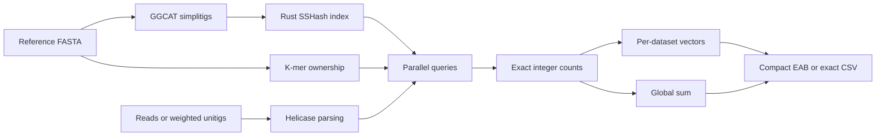

# EXPRESSO

**EXon-level RNA EXPRESsion quantificatiOn**

A parallel Rust tool for counting exon- or gene-specific k-mer observations in reads or
abundance-annotated unitigs. Build an index once, quantify many datasets, and
store one compact abundance vector per dataset plus a global sum.

EXPRESSO combines [**GGCAT simplitigs**](https://github.com/algbio/ggcat),
the [**Rust SSHash dictionary**](https://github.com/COMBINE-lab/sshash-rs), and
[**Helicase FASTA/FASTQ parsing**](https://github.com/imartayan/helicase).

## How it works


```mermaid
flowchart LR
    A[Reference FASTA] --> B[GGCAT simplitigs]
    B --> C[Rust SSHash index]
    A --> D[K-mer ownership]
    C --> E[Parallel queries]
    D --> E
    F[Reads or weighted unitigs] --> G[Helicase parsing]
    G --> E
    E --> H[Exact integer counts]
    H --> I[Per-dataset vectors]
    H --> J[Global sum]
    I --> K[Compact EAB or exact CSV]
    J --> K
```

## Installation

Requirements: **Rust 1.88+**, a C/C++ toolchain, and `pkg-config`.
**GGCAT is built into EXPRESSO** as a Rust dependency and installed automatically
with it; no separate GGCAT installation is required.

```bash
git clone https://github.com/Malfoy/Expresso.git
cd Expresso
cargo build --release --locked
export PATH="$PWD/target/release:$PATH"

expresso --help
```

Alternatively, install the executable into Cargo's binary directory:

```bash
RUSTFLAGS="-C target-cpu=native" cargo install --path . --locked
```

The repository's Cargo configuration enables `target-cpu=native` for SIMD.
Build on the machine that will run EXPRESSO, or one with the same CPU instruction
set. `--features no-pdep` is available for older AMD CPUs.

## Quick start

Run the included small example:

```bash
expresso run \
  --exons examples/exons.fa --index example-index --k 7 \
  --fof examples/datasets.tsv --output example-results \
  --threads 4 --jobs 2 --stats

expresso export \
  --input example-results --output example-csv \
  --compression none --with-names
```

For your own data, build once and reuse the index:

```bash
expresso build \
  --exons exons.fa.gz --index exon-index \
  --k 31 --threads 16 --memory-gb 8

expresso quantify \
  --index exon-index --fof datasets.tsv --output results \
  --threads 16 --jobs 4 --mode unitigs

expresso inspect --index exon-index
```

Use `--mode reads` for FASTA/FASTQ reads, `--mode unitigs` for abundance-annotated
unitigs, or `--mode auto` to infer weighting record by record. Explicit modes in
the dataset list override the command-line mode.

Index, result, and export destinations must be **new directories**. Work is
staged beside the destination and published when complete. `--temp-dir /scratch`
relocates index-construction scratch files.

## Inputs

### Generate exons from a GTF and genome

Extract a FASTA with one header and one unwrapped sequence line per exon:

```bash
expresso extract-exons \
  --gtf annotation.gtf.gz --genome genome.fa.gz --output exons.fa
```

GTF and genome inputs can be plain, gzip, xz, or zstd; compression is detected
from their contents. Repeat `--genome` for multiple FASTA files (for example,
one per chromosome); `--reference` is an alias. Output is plain FASTA by default.
For compressed output, specify both the codec and the matching filename, such
as `--output exons.fa.zst --compression zstd`.

You can also build directly from these inputs, without a separate extraction:

```bash
expresso build \
  --gtf annotation.gtf.gz --genome genome.fa.gz \
  --index exon-index --k 31 --threads 16
```

`run` accepts the same `--gtf` and `--genome` options in place of `--exons`.
The generated FASTA is retained as `reference-exons.fa` inside the index.

Only GTF `exon` features are extracted. Coordinates are 1-based and inclusive;
negative-strand exons are reverse-complemented, including IUPAC ambiguity codes.
Repeated `(contig, start, end, strand)` intervals are merged across transcripts,
while identical sequences at different loci remain separate targets. Available
`exon_id` and `gene_id` attributes are retained in FASTA header descriptions.
Headers use generated IDs and genomic coordinates; special characters in names
are percent-escaped. Output follows genome contig order, then coordinate/strand
order within each contig, independently of GTF line order.

Use the matching **genomic** reference, with exactly the same contig names as
the GTF. Missing or duplicate contigs, invalid coordinates, and invalid exon DNA
are errors. Extraction streams genome records through Helicase and retains the
annotation plus the current contig in memory. Output files must be new and are
published only after successful extraction.

### Reference FASTA

Each FASTA **record** is one target: a header followed by its sequence.
One sequence line per exon is supported; wrapped sequences and CRLF line endings
are also accepted.

```fasta
>exon_1
ACGTTGCAACGTTGCAACGTTGCAACGTTGCA
>exon_2
GGTACCATGGTACCATGGTACCATGGTACCAT
```

Target IDs are 1-based in reference order. The first header token supplies the
name. Duplicate names or identical sequences in separate records remain
separate targets. Short targets and targets without usable unique k-mers remain
in every vector as zeros. A reference without any valid k-mers cannot be indexed.

Transcripts or genes can also be reference records; they are then the units
being quantified. Use `--level gene` for gene references; output columns become `gene_id` and
`gene_name`. The default exon mode retains `exon_id` and `exon_name`.

### Dataset list

Supply one absolute or relative path per line:

```text
/data/sample_A.fastq.gz
reads/sample_B.fasta.xz
unitigs/sample_C.fa.zstd
```

Relative paths resolve from the **list's directory**, not the working directory.
Blank lines and lines starting with `#` are ignored. Paths may contain spaces.
Inferred names include a numeric prefix, such as `000001_sample_A.eab.zst`.
Every line is a dataset: listing the same file twice counts it twice in the sum.

For explicit names and mixed data types, use **actual tabs** between columns:

```text
sample_A	/data/sample_A.fastq.gz	reads
sample_B	reads/sample_B.fa.xz	reads
sample_C	unitigs/sample_C.fa.zstd	unitigs
```

The mode column is optional. Names must be unique and contain only ASCII
letters, digits, `_`, `-`, or `.`; `.` and `..` alone are not valid names.

## Implementation details

### Compression and record formats

Reference and query files can be uncompressed, gzip, xz, or Zstandard.

FASTA and conventional four-line FASTQ are supported. Compression is detected
from file contents, including concatenated gzip/xz/zstd streams. Files do not
need a particular extension for `quantify`; `.zst` and `.zstd` both work.

### Counting semantics

| Setting or rule | Behavior |
| --- | --- |
| k-mer length | Odd k from 3 to 63; default 31 |
| Strand | A k-mer and its reverse complement are equivalent |
| Ambiguity | Non-ACGT bases interrupt k-mers; flanking DNA is never joined |
| Shared sequence | K-mers assigned to multiple targets contribute to none; gene mode groups records by gene ID |
| Repeated sequence | Repetitions within one target retain that target as owner |
| `--mode reads` | Every matching occurrence contributes 1 |
| `--mode unitigs` | Every matching occurrence contributes the header abundance |
| `--mode auto` | Use abundance when present; otherwise count as reads |

Lowercase DNA is accepted. Sequence formatting whitespace is removed.
Occurrences are counted independently, without read deduplication or paired-end
fragment correction. Abundance is a **sum of uniquely assigned k-mer
observations**, without length or library-size normalization: it is not a
transcript count, TPM, or RPKM.

Supported mean-abundance tags are `ka:f:`, `km:f:`, `ka:i:`, and `km:i:`.
A tag may be the first token, including a header without an identifier. Mean
tags take precedence over `KC:i:`. With only `KC:i:`, the weight is
`KC / (sequence_length - assembly_k + 1)`; set `--unitig-k` when the assembly k
differs from the index k. Missing abundance fails in `unitigs` mode; malformed
abundance fails in both `unitigs` and `auto` modes.

Unitig weights apply uniformly along each sequence. Mean coverage cannot recover
the original per-k-mer read counts. Generate GGCAT unitigs with abundance support.

Weights are accumulated as fixed-point millionths; extra decimal places round
half up at ingestion. Each target/dataset is rounded to the nearest integer,
ties up, **after summing**. Reads use exact `u64` counts. Unitig/auto mode uses
`u64` millionths, allowing approximately 18.4 trillion weighted observations per
target/dataset. Overflow is reported explicitly. The shared reference table
includes the number of distinct usable k-mers for downstream normalization.

## Gene quantification

Build a gene index from the annotation and matching genomic reference:

```bash
expresso build --level gene \
  --gtf annotation.gtf.gz --genome genome.fa.gz \
  --index gene-index --k 31 --threads 16

expresso quantify --index gene-index --fof datasets.tsv \
  --output gene-results --threads 16 --jobs 4 --viewer-index
```

`run` accepts `--level gene` too. Exon quantification remains the default. The
quantification level is saved in the index, so `quantify` reuses it automatically.

Gene mode requires `gene_id` on annotated exons. Within each gene, overlapping
exon intervals on the same contig and strand are merged. Separated intervals
remain separate FASTA records: introns and artificial exon junctions are never
introduced. All records bearing the same gene ID share one owner. A k-mer
present in multiple exons of one gene remains usable, while one shared between
different genes is excluded. This cannot be recovered by simply summing an
existing exon index; build a gene index to obtain the correct ownership.

The generated `reference-genes.fa` is retained in the index. Its first header
token is the percent-escaped GTF gene ID; annotations do not substitute gene
symbols. The reference table uses `gene_id,gene_name,length,unique_kmers`, with
1-based numeric IDs and the annotation's gene ID as the name. Length sums the
merged exonic intervals, and unique k-mers are counted once per gene.

Alternatively supply FASTA with `--level gene --genes genes.fa`. Records with
the same first header token are grouped into one gene; disconnected sequences
must be separate records, rather than concatenated. Duplicate gene IDs are
intentional in this mode. Length is the sum of supplied record lengths.

## Outputs and CSV export

### Compact EAB: the default

```text
results/
├── datasets/
│   ├── sample_A.eab.zst
│   └── sample_B.eab.zst
├── global.eab.zst
├── exons.csv.zst
└── manifest.json
```

EAB v1 stores target names **once**, in `exons.csv.zst`. Each vector contains
one code per target in the same order, an integer codebook, a reference SHA-256,
and a CRC checksum. The manifest describes coverage, output files, counting
metrics, and measured approximation errors.

`--bits` accepts **2–16**, default **8**. Eight bits means one payload byte per
target before compression, plus a small header/codebook. Larger values use a
logarithmically spaced codebook fitted to each vector's observed maximum.

- Zero/nonzero status is preserved exactly at every supported width.
- At 8 bits, counts **0–15 are exact**. If the vector maximum is at most 255,
  every count in that vector is exact.
- Larger counts are approximate. More bits generally improve precision; error
  depends on the vector's range and is recorded in the manifest.
- Counts are not clipped to a fixed abundance ceiling.
- Quantization is lossy; the subsequent zstd/gzip/xz compression is lossless.

The design draws on the idea of logarithmic abundance discretization used in
[REINDEER2](https://github.com/Yohan-HernandezCourbevoie/REINDEER2), with its
own encoding and per-vector codebooks. Codes from different vectors must be
decoded before comparing or adding them.

### Global sum and optional statistics

**The global sum is always produced**; no extra flag is required. It sums exact
rounded dataset counts, then independently quantizes that total for compact
output. Consequently, adding decoded dataset values may not reproduce the
decoded global vector exactly.

`--stats` additionally writes mean, median, minimum, maximum, and detected-dataset
count under `statistics/`. Statistics include zero values and are computed from
exact counts before quantization. The detected-dataset count can therefore be
approximate, even though individual vectors preserve presence/absence exactly.
Exact statistics require temporary disk space proportional to targets × datasets.

### Export only what you need

```bash
# Every dataset and the global sum; one abundance column per dataset.
expresso export --input results --output csv --compression zstd

# Selected dataset, plain CSV; repeat --dataset to select more.
expresso export --input results --output selected \
  --dataset sample_A --compression none

# Global sum only, with IDs and names.
expresso export --input results --output global-csv --global-only --with-names
```

Without `--with-names`, dataset CSVs have a single `abundance` column and one
integer per target. Global CSVs also include any requested statistics. With
`--with-names`, target ID and name precede abundance (exon or gene columns). Export writes the selected
reference rows and records source coverage in its manifest.

Select targets, datasets, and an inclusive range of decoded counts:

```bash
expresso export --input results --output subset-csv \
  --target-list selected-exons.txt --dataset-list selected-datasets.txt \
  --min-value 10 --max-value 10000 --compression zstd

# Names or explicit original 1-based IDs; flags can be repeated.
expresso export --input gene-results --output selected-genes \
  --gene ENSG00000123456.7 --target-id 42 --dataset sample_A
```

Lists contain one exact name per line; blank lines and `#` comments are ignored.
Compressed lists are accepted. `--target` (aliases `--exon`, `--gene`) selects
names, `--target-id` selects numeric IDs, and `--target-list` (alias `--exon-list`)
selects names from a file. These target selections are combined as a union.
Duplicate names select all matching targets; numeric IDs distinguish them.
`--dataset-list` and repeated `--dataset` are combined likewise. Unknown names,
out-of-range IDs, empty list files, and reversed bounds are errors.

A target or value filter automatically adds ID/name columns and preserves
original IDs and reference order. Bounds omit nonmatching rows **independently
in each dataset CSV**; they do not clip counts or change the global sum. Bounds
on global export apply to its abundance column. The accompanying reference
table lists selected targets before the value filter; each CSV identifies its
surviving rows. Dataset selection exports those datasets only; without it,
all datasets plus the original global sum are exported. Use `--global-only`
for just the global sum and available statistics.

CSV export returns decoded representatives: it cannot restore values discarded
by quantization. To retain exact original counts from the start, quantify with
`--format csv`. This writes target ID, name, and abundance in every dataset CSV
and an exact global CSV; repeating names makes these files much larger.

| `--compression` | Compact vectors | CSVs |
| --- | --- | --- |
| `zstd` (default, level 3) | `.eab.zst` | `.csv.zst` |
| `gz` | `.eab.gz` | `.csv.gz` |
| `xz` | `.eab.xz` | `.csv.xz` |
| `none` | `.eab` | `.csv` |

This option is independent of input compression. The shared compact reference
is `exons.csv.zst` or `genes.csv.zst`; exact CSV output uses the uncompressed table.

### Portable abundance index and WebAssembly viewer

```bash
# Package a completed compact result directory, including its global sum.
expresso pack --input results --output abundance.eai

# Open the printed localhost URL, then choose abundance.eai in the browser.
expresso view

# The same portable file supports CLI extraction.
expresso export --input abundance.eai --output selected-csv \
  --target-list selected-exons.txt --dataset sample_A --compression none
```

`quantify` and `run` can also generate `results/abundance.eai` automatically
with `--viewer-index` (compact output only). This keeps the standard result files
and adds a portable copy.

`pack` accepts compact results with any supported compression, including older
EAB v1 exon results. It validates every vector and writes a new `.eai` file,
using one independent zstd frame per vector. Encoded values are preserved
without a second quantization. Global and optional statistic vectors are
included. Packing reads the entire result set and requires disk space for the
new file; original results remain reusable.

The viewer is bundled into the Rust executable; Node, npm, a separate web
server, and a WASM toolchain are unnecessary to use it. `view --port 9000`
chooses another localhost port. It serves only the application assets. Selecting
an index does **not** upload it. Target/dataset searches, pasted name or `#ID`
lists, count bounds, logarithmic or linear coloring, and CSV download all run
locally. The global sum and stored statistics are selectable alongside datasets.

Opening a file reads the catalogue (target names, metadata, and vector offsets),
**not the abundance blocks**. Counts are read only after a visualization or
export request. Selections have no 200 × 100 size cap: select all matching
names, paste lists, or select individual targets/datasets.

The heatmap displays pages of 100 targets × 25 datasets. Use the navigation
buttons or jump directly to target/dataset positions in your selection. Each page reads
only the visible datasets and returns only the visible target counts. The rest
of the selected matrix is neither decoded nor retained in RAM. Colors scale to
the current page, so compare cells on that page using its legend.

With EAI v1, each dataset is one zstd frame. Reading any target from it requires
decompressing that dataset block; the viewer cannot seek directly to a target
inside the compressed frame. Rust/WebAssembly validates the EAB reference,
checksum, padding, and codes and keeps **one bit-packed vector** cached, rather
than a full array of decoded counts. Changing dataset evicts that cache. At 8
bits, its abundance payload is approximately one byte per reference target.
Only requested counts cross back to the page, as decimal strings; JavaScript
`BigInt` preserves the entire 64-bit integer range. No other abundance vectors
are read until requested. WebAssembly retains its peak linear-memory capacity
for reuse even after allocations are freed.

**Visible CSV** exports the displayed target-by-dataset matrix, with blank
fields for out-of-range cells. **Full selection CSV** streams the entire
selection in long format (`target_id,target_name,dataset,abundance`, using exon
or gene column names). It applies inclusive bounds and omits nonmatching rows.
Export processes one dataset at a time, extracts up to 512 requested counts per
chunk, and writes to local browser temporary storage; it does not accumulate the
CSV or selected matrix in RAM. Download the finished file, then use **Clear
temporary CSV** to remove that local copy. Temporary export storage is subject
to the browser's disk quota. CLI exports remain one CSV per dataset.

Memory therefore depends on the catalogue, selected ID lists, one dataset's compressed/bit-packed
vector and decompressor, and the current page/export chunk, rather than the
whole abundance file or selected matrix. The catalogue must still fit in memory
and EAI v1 limits it to 256 MiB; this is a metadata limit, not an abundance-file
size limit. Open through `expresso view`, rather than `file://`, so WebAssembly,
workers, local temporary storage, and checksums are available.

The app's Rust source and a prebuilt WASM module are included. To rebuild it:

```bash
rustup target add wasm32-unknown-unknown
env RUSTFLAGS= cargo build --manifest-path viewer/wasm/Cargo.toml \
  --target wasm32-unknown-unknown --release --locked
cp viewer/wasm/target/wasm32-unknown-unknown/release/expresso_viewer.wasm \
  viewer/expresso_viewer.wasm
cargo build --release --locked
```

Empty `RUSTFLAGS` overrides the native CPU setting for the WASM build. EAI v1
starts with `EXPREAI1`, little-endian 64-bit catalogue offset and length, then
independent zstd-compressed EAB blocks. A trailing JSON catalogue records target
metadata, vector kind/name/offset/length, and coverage; a SHA-256 follows it.
The same EAB validation code is compiled into the native tool and WASM decoder.

### Failed datasets

Normally, a dataset error stops the run. `--keep-going` records input/counting
failures and continues with the rest. Failed datasets contribute **no partial
counts** to the global sum. The final manifest lists their errors and records
`coverage.complete: false`. CSV export preserves this information.

Output/aggregation errors remain fatal. An all-failed run is not published.
`--keep-going` cannot be combined with `--stats`. Invalid dataset lists and
missing paths are rejected before processing. There is no automatic checkpoint
resume; completed vectors are staged until the overall run is published.

## Validation

```bash
cargo fmt --check
cargo test --locked
cargo clippy --all-targets --locked -- -D warnings
env RUSTFLAGS= cargo test --manifest-path viewer/wasm/Cargo.toml --locked
```

An optional Rust browser test checks a 300-target × 151-vector selection,
on-demand reads, page navigation, full streamed CSV, and 64-bit values. With
Firefox and geckodriver installed, start the driver in another terminal and run:

```bash
geckodriver --host 127.0.0.1 --port 4444
# In another terminal:
cargo test --test viewer_browser --locked -- --ignored
```

Rust tests cover the EAB codecs and bit widths, integer boundaries, integrity
checks, exon and gene ownership, weighted counting, filtered export, portable
index round trips, global sums, and failures.
Integration tests use the bundled GGCAT library with an empty `PATH` and compare
counts with an independent canonical-k-mer oracle. No separate tools or Python
scripts are needed to run the tests.

## Upstream projects

- [GGCAT](https://github.com/algbio/ggcat) — simplitig construction.
- [Rust SSHash](https://github.com/COMBINE-lab/sshash-rs) — compressed k-mer dictionary.
- [Helicase](https://github.com/imartayan/helicase) — SIMD FASTA/FASTQ parsing.
- [Logan](https://github.com/IndexThePlanet/Logan) — unitig datasets and abundance headers.
- [REINDEER2](https://github.com/Yohan-HernandezCourbevoie/REINDEER2) — logarithmic abundance discretization inspiration.

`Cargo.lock` pins dependency versions. GGCAT 2.1.0 is pinned to an upstream Git
revision and compiled into EXPRESSO; SSHash 0.7.1 and Helicase 0.2.0 are also
pinned explicitly in `Cargo.toml`. EXPRESSO handles xz through its shared liblzma
dependency before passing the stream to Helicase; gzip/zstd use Helicase's input
layer. EAB is EXPRESSO's own format and is not REINDEER2-compatible.
